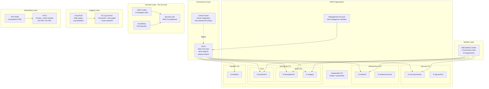

# Platform Overview

## Design Goals

- Demonstrate production-style AWS multi-account governance using Terraform
- Implement defense-in-depth security across preventive, detective, and audit layers
- Maintain clear module boundaries with independent testability
- Define explicit Control Tower integration boundaries without requiring CT deployment
- Validate everything without AWS credentials using mocked providers
- Document architectural decisions through ADRs

## Architecture Diagram



## Design Principles

| Principle | Implementation |
|-----------|---------------|
| Least privilege | SCPs deny broad actions; permission sets use bounded policies |
| Defense in depth | Preventive (SCPs) + Detective (Config/GD/SH) + Audit (CloudTrail) |
| Separation of duties | Security OU isolated; developers can't access production |
| Centralized governance | Organization-level SCPs; future CT integration |
| Account isolation | Each account is a blast-radius boundary |
| Immutable infrastructure | All resources defined as code; no console changes |
| Reusable modules | 10 independent modules compose into environments |
| Explicit ownership | CT vs Terraform boundaries documented in ADR-010 |
| Test before deploy | 155 tests validate before any infrastructure change |
| Credential-free CI | Entire pipeline works without AWS access |

## Account Hierarchy

```
Root (management - billing, org admin)
├── Security OU
│   ├── lz-security-tooling (future delegated admin)
│   └── lz-log-archive (audit log storage)
├── Infrastructure OU
│   ├── lz-network (IPAM, future TGW/DNS)
│   └── lz-shared-services (CI/CD, artifacts)
├── Workloads OU
│   ├── NonProd
│   │   ├── lz-development
│   │   └── lz-staging
│   └── Prod
│       └── lz-production
├── Sandbox OU
│   └── lz-sandbox
└── Suspended OU (quarantine - deny-all SCP)
```

## Governance Layers

### Layer 1: Preventive (SCPs)

Block dangerous actions before they occur:
- **deny-root-user**: Prevents root API usage in member accounts
- **deny-unapproved-regions**: Restricts to us-east-1, us-west-2 (configurable)
- **require-imdsv2**: Prevents EC2 launches without IMDSv2

Targeted by OU — Security OU excluded from some controls for incident response.

### Layer 2: Detective (per-account)

Observe and report non-compliance:
- **AWS Config**: 4 managed rules (S3 public, encrypted volumes, root MFA, CloudTrail)
- **GuardDuty**: Threat detection with S3 data event protection
- **Security Hub**: AWS Foundational Security Best Practices standard

### Layer 3: Audit

Durable evidence for forensics and compliance:
- **CloudTrail**: Multi-region, log file validation, management events
- **S3 Log Archive**: Versioned, AES256 encrypted, 7-year lifecycle

## Security Model

```
┌─────────────────────────────────────────┐
│ PREVENTIVE: SCPs block at API level     │
├─────────────────────────────────────────┤
│ DETECTIVE: Config + GuardDuty + SecHub  │
├─────────────────────────────────────────┤
│ AUDIT: CloudTrail → S3 Log Archive     │
├─────────────────────────────────────────┤
│ IDENTITY: Least-privilege permission    │
│           sets with session limits      │
└─────────────────────────────────────────┘
```

## Networking Model

- **IPAM**: Centralized CIDR planning (10.x.0.0/16 per environment)
- **VPCs**: Private + data subnets, 2-AZ, no internet access by default
- **Future**: Transit Gateway hub-spoke, Route 53 Resolver, inspection VPC

## Identity Model

5 permission sets with group-based assignments:
- Developers → dev + staging (not production)
- Security team → security + log-archive
- Network team → network account
- Platform admins → security + network (not all accounts)
- Auditors → production (read-only)

## Control Tower Ownership Boundary

| CT Owns | Terraform Owns |
|---------|---------------|
| Org trail | Custom SCPs |
| Baseline Config | Custom Config rules |
| Mandatory SCPs | GuardDuty/SecurityHub |
| LZ IAM roles | IPAM, VPCs |
| Account enrollment | Permission sets |
| CT log archive | Platform log archive |

## Terraform Composition Model

```
modules/ (10 independent, testable modules)
    ↓ outputs
environments/reference/ (composition layer)
    ↓ wiring via locals
Architecture summaries (outputs)
```

## CI Validation Model

6 credential-free gates:
1. `terraform fmt` — consistent style
2. `terraform validate` — structural correctness
3. `terraform test` — behavioral assertions (155 tests)
4. Checkov — static security analysis
5. gitleaks — secret detection
6. OPA/Conftest — governance policy enforcement

## Known Limitations

- No real AWS deployment (portfolio validation only)
- Account-level security (no org-wide admin yet)
- Static CIDRs (IPAM documents plan, doesn't dynamically allocate)
- No Transit Gateway (VPCs isolated)
- No org-level CloudTrail
- Security tools execute in CI (may not be locally installed)
